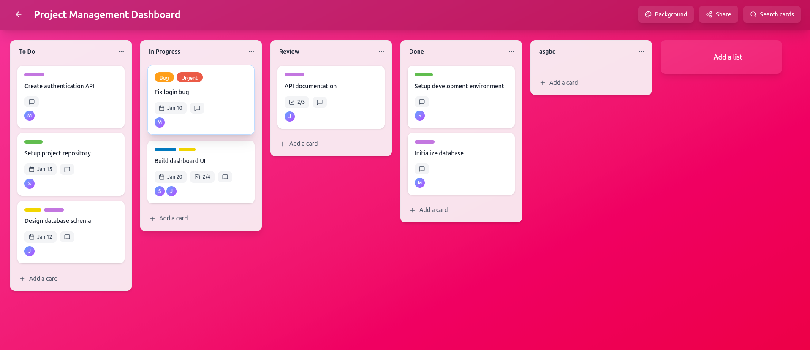

# Trello Clone - Frontend

A fully-featured Kanban-style project management application built with Next.js that closely replicates Trello's design and user experience.



## Tech Stack

**Framework:** Next.js 16 (React 19)  
**Language:** TypeScript  
**Styling:** Tailwind CSS v4  
**State Management:** TanStack Query (React Query v5)  
**Drag & Drop:** @dnd-kit  
**Icons:** Lucide React  
**Date Handling:** date-fns

## Architecture & Technical Features

- **Next.js 16** with App Router and React Server Components
- **TypeScript** for complete type safety across the application
- **TanStack Query (React Query v5)** for server state management, caching, and optimistic updates
- **dnd-kit** for accessible drag & drop functionality
- **React Portal** for modal rendering outside DOM hierarchy
- **Tailwind CSS v4** for utility-first styling with custom gradients
- **Lucide React** for modern, consistent iconography
- **date-fns** for efficient date formatting and manipulation

## Core Features

- **Board Management** - Create, view, and manage multiple boards
- **Board Customization** - 12 beautiful gradient background themes for each board
- **Board Sharing** - Share boards via URL copy or email with pre-filled invitation template
- **List Management** - Create, edit, delete, and reorder lists via drag & drop
- **Card Management** - Full CRUD operations with drag & drop between lists
- **Card Details Modal** - Comprehensive card editing interface with React Portal rendering
- **Labels** - Create and assign colored labels to cards
- **Checklists** - Add checklists with items, track progress
- **Due Dates** - Set and display due dates with overdue indicators
- **Search & Filter** - Advanced search by title, filter by labels and due dates
- **Drag & Drop** - Smooth drag & drop for lists and cards using dnd-kit
- **Responsive Design** - Fully responsive layout for desktop, tablet, and mobile

## Setup Instructions

### Prerequisites

- Node.js 20+ installed
- Backend API running (default: http://localhost:8000)

### Installation Steps

1. **Clone the repository** (if not already cloned)
   ```bash
   cd /home/shradhesh/Desktop/web2/scaler/frontend
   ```

2. **Install dependencies**
   ```bash
   npm install
   ```

3. **Configure environment variables**  
   Create a `.env` file in the root directory:
   ```env
   NEXT_PUBLIC_BACKEND_URL=http://localhost:8000
   ```

4. **Run the development server**
   ```bash
   npm run dev
   ```

5. **Open the application**  
   Navigate to `http://localhost:3000` in your browser

### Build for Production

```bash
npm run build
npm start
```

## Project Structure

```
src/
├── app/
│   ├── boards/[id]/page.tsx   # Board detail page with dynamic gradients
│   ├── globals.css             # Global styles
│   ├── layout.tsx              # Root layout with providers
│   └── page.tsx                # Home page (boards list)
├── components/
│   ├── boards/                 # Board-related components
│   │   ├── board-header.tsx           # Header with share, search, background buttons
│   │   ├── board-content.tsx          # Main board content with drag & drop
│   │   ├── board-background-modal.tsx # Background customization modal
│   │   ├── share-board-modal.tsx      # Share via URL/email modal
│   │   └── create-board-modal.tsx     # New board creation
│   ├── cards/                  # Card-related components
│   │   ├── card-item.tsx              # Individual card display
│   │   ├── card-details-modal.tsx     # Full card editor with portal
│   │   ├── card-labels.tsx            # Label management
│   │   ├── card-checklist.tsx         # Checklist display/edit
│   │   ├── card-due-date.tsx          # Due date picker
│   │   └── add-card-button.tsx        # Quick card creation
│   ├── lists/                  # List-related components
│   │   ├── list-column.tsx            # Draggable list container
│   │   └── add-list-button.tsx        # New list creation
│   └── search/                 # Search components
│       └── search-modal.tsx           # Advanced card search
├── lib/
│   ├── api.ts                  # API client with error handling
│   ├── query-client.ts         # React Query configuration
│   ├── board-backgrounds.ts    # Gradient theme mappings
│   └── utils.ts                # Utility functions
├── providers/
│   └── query-provider.tsx      # React Query provider setup
└── types/
    └── index.ts                # Complete TypeScript type definitions
```

## UI/UX Design

The application closely follows Trello's modern design patterns:

- **Dynamic Gradient Backgrounds** - 12 beautiful color themes with smooth gradients
- **Glass-morphism Effects** - Frosted glass header with backdrop blur
- **Clean Card Design** - White cards with subtle shadows and hover effects
- **Horizontal Scrolling** - Natural side-scrolling for lists
- **Smooth Animations** - Scale transforms, fade effects, and transitions
- **Portal-based Modals** - Properly positioned modals outside DOM hierarchy
- **Intuitive Drag & Drop** - Visual feedback during dragging with opacity changes

## Key Features Implemented

### Board Customization
- 12 pre-defined gradient themes (Ocean Blue, Sunset Orange, Forest Green, etc.)
- Real-time background updates with smooth transitions
- Color-to-gradient mapping system

### Sharing Functionality
- One-click URL copying to clipboard
- Email sharing with professional pre-filled template
- Includes board title, description, and personal message option

### Advanced Drag & Drop
- List reordering within boards
- Card movement within lists
- Card movement between lists
- Visual feedback during drag operations
- Automatic position recalculation

### Search & Filtering
- Full-text search across card titles
- Filter by labels (color-coded)
- Filter by due date ranges
- Real-time search results

## Assumptions Made

1. **Authentication:** No login system implemented; assumes single default user
2. **Board Access:** All boards are publicly accessible via URL sharing
3. **Email Integration:** Uses `mailto:` protocol which opens user's default email client
4. **Members:** Backend member data structure exists but member assignment UI not fully implemented
5. **File Attachments:** API endpoint exists but file upload UI not implemented in current version
6. **Comments:** API endpoint exists but commenting UI not implemented in current version
7. **Real-time Updates:** Using React Query's automatic refetching instead of WebSockets
8. **Browser Support:** Modern browsers with ES6+ support (Chrome 90+, Firefox 88+, Safari 14+)
9. **Background Storage:** Board backgrounds stored as hex color codes, mapped to gradients in frontend
10. **Data Persistence:** All data persists in backend database; no local storage used

## Author

Shradesh Jodawat

